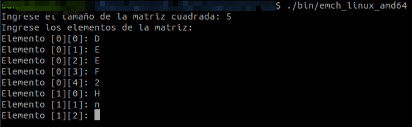

# Solución al challenge: "Encuentra la subcadena más larga presente en una matriz"

El código contenido en esta solución es la implementación para cumplir con el requerimiento del desafío de código propuesto. El lenguaje utilizado es Golang, versión 1.20

## Método de ingreso
El código solicitará el ingreso de los elementos de la matriz desde la consola de comandos:



## Ejecución

Para ejecutar el presente código existen n alternativas:

1. __Ejecutar el archivo binario.__
Se debe ejecutar el archivo binario según el Sistema Operativo de la máquina host:

- emch_linux_amd64
- emch_macos_amd64
- emch_windows_amd64.exe

luego, desde la consola de comandos:
```path_del_repositorio_clonado/bin``` >> ``` emch_windows_amd64.exe ``` (para el caso de uso del Sistema Operativo Windows).

2. __Descargar Go 1.19+ y compilar el código.__

Desde el sitio https://go.dev/dl/ se puede descargar la versión de Golang deseada, tomando en cuenta la arquitectura y Sistema Operativo de la máquina host en la cual se instalará.

Una vez instalada la versión de Golang, se debe ejecutar el siguiente comando desde la consola de comandos:
```path_del_repositorio_clonado/``` >> ``` go run main.go ```